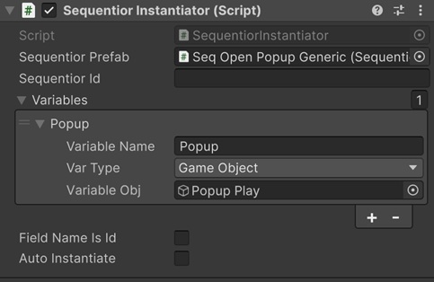

# Dynamic Sequentiors

Dynamic sequentiors are like animation prefabs and can be defined once and used in multiple game objects. So if you change the sequentials in the prefab sequentior, all the animations will change accordingly for each of the game objects it assigned to.

!!! quote "How to create?"
    Because dynamic sequentior are just prefabs, just drag and drop a gameobject that has [Sequentior Manager](sequentiormanager/index.md) component attached to the Project View.

To instantiate a dynamic sequentior from your game logic, you need to add __Sequentior Instantiator__ component to the game object that will responsible for instantiating.



``` csharp title="Instantiate from MonoBehaviour script"
    // to instantiate the sequentior, call the InstantiateSequentior() method
    dynamicSeqManager.InstantiateSequentior(this);
```

## Sequentior Prefab
This is the prefab that will be instantiated which has Sequentior Manager component attached.

## Sequentior Id
This will assign the Id to the instantiated Sequentior Manager.

For some cases, especially when [Auto Instantiate](#auto-instantiate) is checked, you might need to assign the instantiated sequentior to the field of the MonoBehaviour instance that has the Sequentior Instantiator component. For those kind of cases, Sequentior Id is important.

## Variables
You can override the variables in the Dynamic Sequentior prefab. It replaces the instantiated sequentior manager's variables list with this one if there is at least one variable in this list.

## Field Name is Id

If this is enabled, it searches for a field named exactly the same with __Sequentior Id__ in the MonoBehaviour class that has the Sequentior Instantiator component. If it finds, it will assign the instantiated object to this field.

To this work, you need to add DynamicSequentior attribute to the field name:
``` csharp
[DynamicSequentior()]
public SequentiorManager OpenSeq;
```

If "Field Name is Id" is not enabled but still you want to assign to a field, you can explicitly set the field name like that:

``` csharp
// replace DynamicSeqId with the Sequentior Id of Sequentior Instantiator component
[DynamicSequentior("DynamicSeqId")]
public SequentiorManager OpenSeq;
```

## Auto Instantiate

If checked, you don't need to call the InstantiateSequentior() method manually. It will auto instantiate the prefab on Start().


