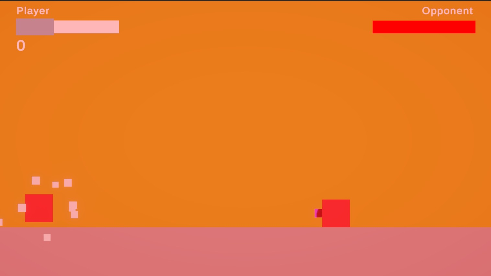
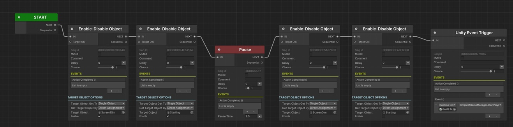
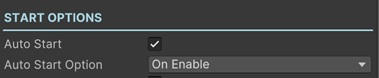
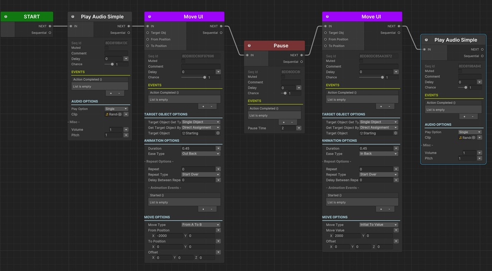
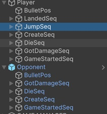

# Simple Game




In this simple game, you can learn how to make a boring game more enjoyable by adding animations via Sequentiors.

Here, we'll go through some of the sequentiors runs in this game.

You'll find a __GAME MANAGER__ object in this scene which manages the game logic. There are 2 sequentiors inside this game object: _StartingSeq_ and _GameOverSeq_.

## Starting Sequentior



This is the sequentior that will play when the game manager starts the game.

In this sequentior, we want to show the starting UI elements (_CanvasWorld > Starting_ and _CanvasWorld > ScreenDim_) we simply enable the elements that are already in the scene.

### Starting UI Element Animation Sequentior

When we enable the _Starting_ UI element, the sequentior in the _Animation_ gameobject will be played automatically because we set the __Auto Start__ enabled and set the __Auto Start Option__ to __On Enable__.



In this _Animation_ sequentior:

* __Play Audio:__ This simply plays a sound clip.
* __Move UI:__ This moves the _Starting_ UI element from the left side of the screen (with an offset of -2000) and moves it to the center of the screen.
* __Pause:__ After showing the _Starting_ UI element we pause the animation for a fixed duration to let the player see it. This sequential holds the next sequentials for its duration.
* __Move UI:__ This moves the _Starting_ UI element from its current (initial) position to the 2000 x pos which moves it off the screen by right side.
* __Play Audio:__ We play a sound clip while it's moving to the right side.



# Player and Opponent Sequentiors

Player gameobject has a few sequentiors that plays when a specific event happens in the Simple01PlayerShip component. Same mechanism works for the opponent game object too. 

For example when the player ship jumps it will starts the related sequentior:

``` c#
protected void OnJump()
{
    if (Sequentior_Jump != null)
        Sequentior_Jump.StartAllSequentials();
}
```

You can look at the sequentiors of Player and Opponent game objects to see how the animations and effects are designed.



