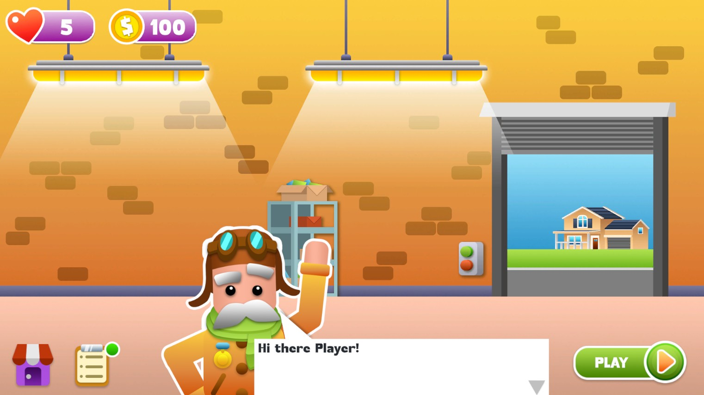
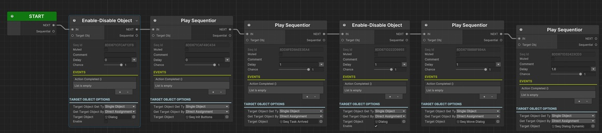
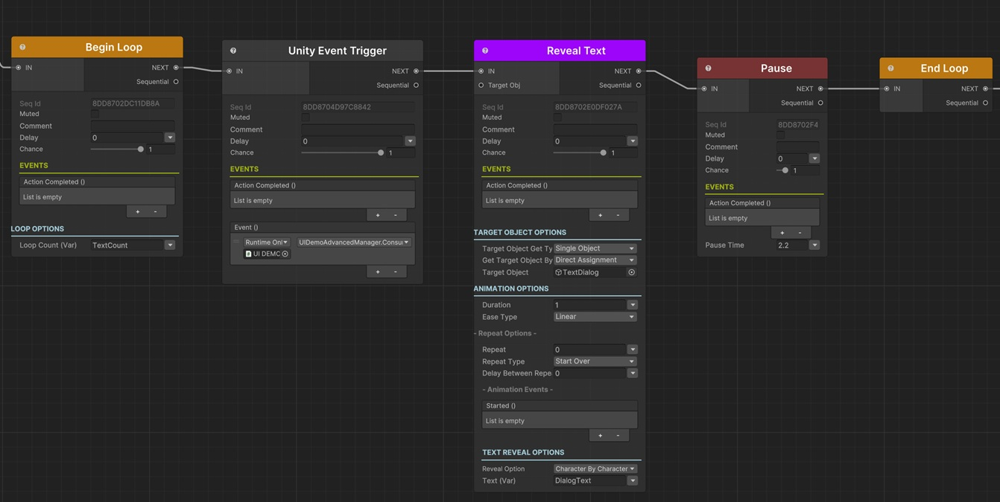
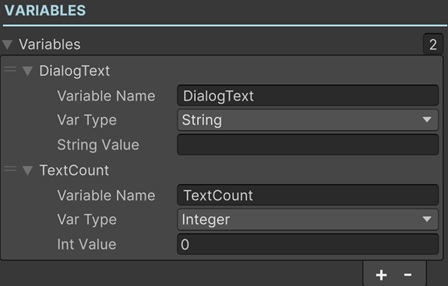
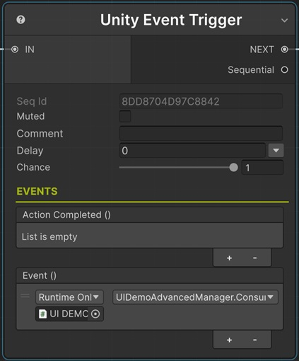
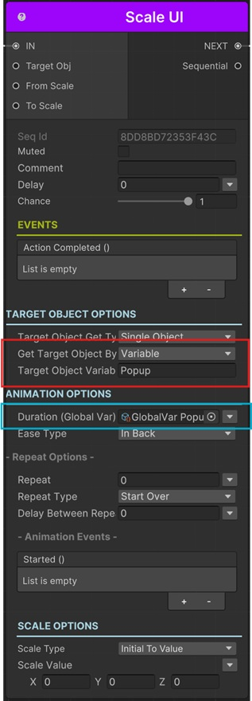
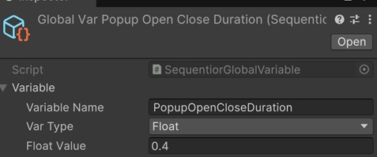
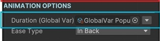

# UI Demo Advanced



This sample scene demonstrates some common UI stuff that can be done with some advanced usage of Sequentior.

Child game objects of __SEQUENTIALS__ game object in the scene have __Sequentior Manager__ components which you can examine and learn how they work.

## Starting Sequentior



This sequentior will play automatically on start.

It basically plays other sequentiors one by one with some delays.

## Dynamic Dialog Sequentior



This is a little bit complicated but it demonstrates a powerful mechanism to integrate sequentials with custom code.

In this sequentior, we want to reveal dialog texts with animation. This can be done simply by adding a [Reveal Text Sequential](../sequentials/textsequentials/sequential_revealtext.md) and setting the text to reveal. But in this project we're getting the texts of the dialogs dynamically at runtime. So we need a [Variable](../variables/variables.md) to be defined in the Sequentior Manager.



Here we've added a variable named __DialogText__ with String data type. And we set the __Text__ option of the Reveal Text Sequential to variable and assign it __DialogText__ by using [Value Assign Options](../valueassign.md). 

Now, what we need to do is to assign values to this __DialogText__ variable from our custom script.

``` c#
 /// <summary>
/// This will be called from Reveal Text Sequentials
/// </summary>
public void ConsumeDialogText()
{
    // SeqDialog sequentior should have a string variable named DialogText
    var dialogTextVar = SeqDialog.GetVariable("DialogText");
    if (dialogTextVar != null && currentDialogTextIndex < DialogTexts.Length)
    {
        // set the sequentior variable to the current dialog text
        // look at the SeqDialog to see some sequentials (e.g. Reveal Text) using this variable to get the values
        dialogTextVar.StringValue = DialogTexts[currentDialogTextIndex];
        // and get the next one ready
        currentDialogTextIndex++;
    }

}
```

As you see, in ConsumeDialogText() method, we get the current dialog text from the __DialogTexts__ property of __UIDemoAdvancedManager__ script of __UI Demo Manager__ game object in the scene. And we call the ConsumeDialogText() method from our Sequentior by [Unity Event Trigger Sequential](../sequentials/eventtriggersequentials/sequential_unityeventtrigger.md). When this sequential plays as the first sequential inside the [Loop Sequential](../sequentials/loopsequentials/index.md).




## Dynamic Sequentior

In this project, we use [Dynamic Sequentiors](../dynamicsequentior.md) for displaying popups because every popup uses the same animations for show and hide mechanisms. So we define sequentior prefabs for each animations (_UIDemoAdvanced > Prefabs > Sequential Prefabs_) and play these sequentiors for any popup. 

To instantiate one of these sequentior prefabs, we've defined a method in _UIDemoAdvancedManager_ class:

``` c#
/// <summary>
/// Instantiates a sequentior from a prefab
/// </summary>
/// <param name="seqPrefab"></param>
/// <returns></returns>
public SequentiorManager InstantiateSequentior(SequentiorManager seqPrefab)
{
    var seqInstantiator = GetComponent<SequentiorInstantiator>();
    seqInstantiator.SequentiorPrefab = seqPrefab;
    return seqInstantiator.InstantiateSequentior(this);

}
```

For example, below is the sequential used for closing a popup game object:



As you see, we set the __Get Target Object By__ parameter to __Variable__ and set the __Target Object Variable__ to __Popup__. So whenever we need to close a popup we need to set this __Popup__ variable to the popup we want to close.

``` c#
/// <summary>
/// Closes a popup by instantiating a Sequentior Manager prefab
/// </summary>
/// <param name="popup"></param>
public void ClosePopup(GameObject popup)
{
    // instantiate the close popup sequentior and hold it in a var
    var seqPopup = InstantiateSequentior(SeqClosePopupPrefab);

    // set the Popup gameobject variable to the popup because this sequentior gets the Target Object from a variable named Popup.
    // see the sequentior manager in Prefabs/Sequential Prefabs
    seqPopup.GetVariable("Popup").VariableObj = popup;
}
```

This is how we control the dynamic (prefab) sequentiors from our scripts.

## Popup Animation Global Variable

Also, you'll see that the __Duration__ parameter of the __Scale UI Sequential__ in _Open Popup_ and _Close Popup_ sequentior prefabs [above](#dynamic-sequentior) is set to a __Global Variable__ by using [Value Assign Options](../valueassign.md).

We've created a global variable  named __GlobalVar Popup Open Close Duration__ in _UIDemoAdvanced > Global Variables_ folder and set the __Duration__ to this global variable.





This way, we've created a way to control the duration of the open and close animations for __all popups__ in this project. So if we think the popups opens too slow or too fast, we just need to modify the value of the global variable and that's it!

!!! note
    You can learn more about global variables by clicking [here](../variables/globalvariables.md).