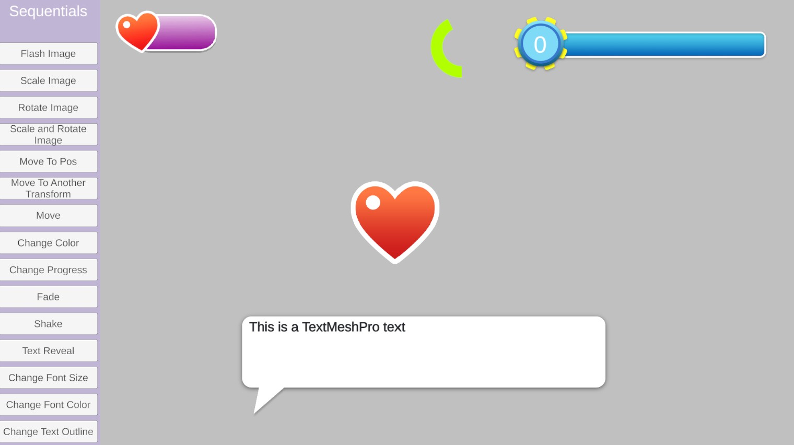
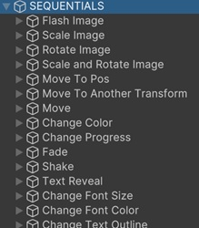

# UI Demo

This sample scene demonstrates the UI animations that can be done by using misc Sequentials.

Just expand the __SEQUENTIALS__ gameobject in the scene and all the child game objects have their own Sequentior Manager component which you can learn how it works.

