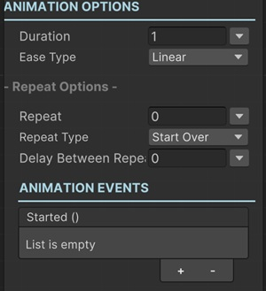
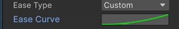

# Animation Sequentials

Most of the sequentials that modifies a value of a game object derives from the Animation Base Sequential.

This sequential lets you define how to animate the related values of a sequential that's derived from Animation Base Sequential.

So every option explained here apply to other sequentials that's derived from Animation Sequential.

!!! warning
    You cannot add an Animation Sequential directly. Consider it as an abstract class. Only descendant sequentials can be added to the Sequentior Manager.

## Duration

This is the duration of the animation (in seconds.)

You have multiple options to assign a value here. So for example, you can define a global variable for a specific animation duration (e.g. popup open animation duration) and use that global variable for the Duration property.

!!! info
    To learn more about assigning values with different options, see [Value Assign](../../valueassign.md)

## Ease Type

This is the easing function to calculate the value of the animation at a certain time.

You can choose from a predefined ease functions or select the Custom option and create an animation curve for your specific needs.

!!! tip
    Try several Ease Type for your animations to create some cool effects.

## Overshoot

For some Ease Types you can define an overshoot value to give the ease function's curve custom overshoot.

For example, you can set a multiplier (overshoot) for InBack ease so it moves more at the beginning of easing.

## Repeat Options

If you want to make the animation repeat itself, you can set the paremeters in this section.

### Repeat

How many times to repeat the same animation.

!!! tip
    Setting it to -1 repeats the animation forever.

### Repeat Type

#### Start Over
This resets the values of the animation and after that plays it again.

#### Ping Pong
This plays the animation forwards and then backwards and then forwards...

### Delay Between Repeats

How many seconds to wait between each repeat.

## Animation Events

This section has the Unity events that can be called when an action is occurred in this sequential.

### Started Event

When this animation sequential is started playing animation, it will call this Unity Event.
