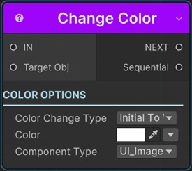
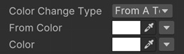

# Change Color Sequential

This sequential changes the color of a game object with animation.

!!! tip
    For changing the color of a gameobject that's not possible with this sequential, you can use the [Change Material Color Sequential](../materialsequentials/sequential_changematerialcolor.md)

!!! note "Base Properties"
    To learn about the common Base Properties, please see [Base Sequential](../sequential_base.md)

!!! note "Target Object Options"
    This sequential derives from __Object Returner Sequential__ and gets all its properties from that sequential. So, to learn about the __Target Object Options__ please see [Object Returner Sequential](../sequentialobjectreturner/index.md)

!!! note "Animation Options"
    This sequential derives from __Animation Sequential__ and gets all of its properties. So, to learn about the __Animation Options please see [Animation Base](index.md)

## Color Change Type

This option determines the calculation of the end color.

### Initial to Value

This changes the color of the target transform from its initial value (the value before this sequential starts) to the __Color__ value.

### From Value to Initial

This instantly sets the color of the target transform to the __Color__ and then modifies it to its initial value again with animation.

### Initial Plus Value

This adds __Color__ to the target transform's initial color value and changes it to the calculated value.
 

### Initial Multiply Value

This multiplies each component (R,G,B,A) of the transform's initial color with the corresponding component of the __Color__ and changes the target transform color to the calculated color value.

### From A to B

This lets you define the starting color and end color of the animation independent from the initial color of the target transform.

## Color

This is the Color value that determines the end color in accordance with the __Color Change Type__ option as explained above.

It's possible to assign different kind of values to this property (e.g. directly, randomly, from variable).

!!! info
    To learn more about assigning values with different options, see [Value Assign](../../valueassign.md)

## From Color

This is only available when the __Color Change Type__ is __From A to B__.

This is the starting color value of the animation.

## Component Type

Because not all game objects have Color property, this sequential needs some specific types of target objects to work properly.

So, the target object needs to be one of the types below and you need to choose the correct type for this property:

### UI_Image
This is the UI Image component.

That means, it expects the target object to be UI Image component.

### Sprite Renderer
This is the Sprite Renderer component.

That means, it expects the target object to be a Sprite Renderer component.

### TMP_Text
This is the TextMeshPro component.

That means, it expects the target object to be TextMeshPro component.

!!! warning
    To use TextMeshPro in Sequentior, you need to setup it as explained [here](../../setup.md)

