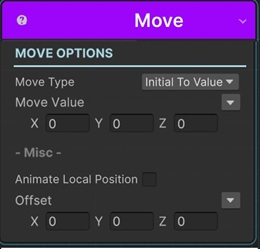
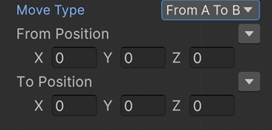

# Move Sequential

This sequential moves a transform with animation.

!!! note "Base Properties"
    To learn about the common Base Properties, please see [Base Sequential](../sequential_base.md)

!!! note "Target Object Options"
    This sequential derives from __Object Returner Sequential__ and gets all its properties from that sequential. So, to learn about the __Target Object Options__ please see [Object Returner Sequential](../sequentialobjectreturner/index.md)

!!! note "Animation Options"
    This sequential derives from __Animation Sequential__ and gets all of its properties. So, to learn about the __Animation Options please see [Animation Base](index.md)

## Move Type

This option determines the calculation of the end value of the move action.

### Initial to Value

This moves the target transform from its initial value (the value before this sequential starts) to the __Move Value__.

### From Value to Initial

This teleports the target transform to the __Move Value__ and then moves it to its initial value again.

### Initial Plus Value

This adds __Move Value__ to the target transform's initial value and moves it to the calculated position.

For example, to move a transform 10 units right and 20 units up, but if you don't know the exact target position you can use this option with Move Value (10,20). 

### Initial Multiply Value

This multiplies each axis of the transform's initial position with the corresponding axis of the __Move Value__ and moves the target transform to the calculated position.

### From A to B

This lets you define the starting position and end position of the move animation independent from the initial position of the target transform.

## Move Value

This is the Vector3 value that determines the end position in accordance with the __Move Type__ option as explained above.

It's possible to assign different kind of values to this property (e.g. directly, randomly, from variable).

For example, to move the target transform to the position of another transform, you can select __Another Transform__ or __Sequential__ for the value assigning option and then choose the transform to go.

!!! info
    To learn more about assigning values with different options, see [Value Assign](../../valueassign.md)

!!! tip
    When you assign Move Value with __Sequential__ option, you need to connect the related sequential's Sequential output port to this sequential's __To Position input port__. 

## From Position

This is only available when the __Move Type__ is __From A to B__.

This is the starting position of the move animation.

!!! tip
    When you assign From Position with __Sequential__ option, you need to connect the related sequential's Sequential output port to this sequential's __From Position input port__. 

## To Position

This is only available when the __Move Type__ is __From A to B__.

This is the end position of the move animation.

!!! tip
    When you assign To Position with __Sequential__ option, you need to connect the related sequential's Sequential output port to this sequential's __To Position input port__. 

## Animate Local Position

By default, this sequential moves the target transform by modifying its _transform.position_ property. But sometimes you might need to modify its local transform. So if you enable this option, it modifies _transform.localPosition_ instead.

## Offset

This adds an offset to the end position that's calculated by the __Move Type__ and __Move Value__ parameters.

!!! tip
    This is especially useful when you set the __Move Value__ to __Another Transform__ or __Sequential__ because you may want to move the target transform to another transform's position but with an offset.