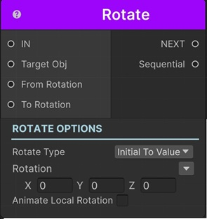
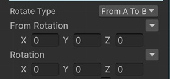

# Rotate Sequential

This sequential rotates a transform with animation.

!!! note "Base Properties"
    To learn about the common Base Properties, please see [Base Sequential](../sequential_base.md)

!!! note "Target Object Options"
    This sequential derives from __Object Returner Sequential__ and gets all its properties from that sequential. So, to learn about the __Target Object Options__ please see [Object Returner Sequential](../sequentialobjectreturner/index.md)

!!! note "Animation Options"
    This sequential derives from __Animation Sequential__ and gets all of its properties. So, to learn about the __Animation Options please see [Animation Base](index.md)

## Rotate Type

This option determines the calculation of the end value of the rotate action.

### Initial to Value

This rotates the target transform from its initial value (the value before this sequential starts) to the __Rotation__.

### From Value to Initial

This instantly sets the rotation of the target transform to the __Rotation__ and then rotates it to its initial value again.

### Initial Plus Value

This adds __Rotation__ to the target transform's initial rotation value and rotates it to the calculated value.

For example, to rotate a transform 10 degrees on X axis and 20 degrees on Y axis, but if you don't know the exact target rotation you can use this option with Rotation (10, 20, 0). 

### Initial Multiply Value

This multiplies each axis of the transform's initial rotation with the corresponding axis of the __Rotation__ and rotates the target transform to the calculated rotation.

### From A to B

This lets you define the starting rotation and end rotation of the rotate animation independent from the initial rotation of the target transform.

## Rotation

This is the Vector3 value (in degrees) that determines the end rotation in accordance with the __Rotate Type__ option as explained above.

It's possible to assign different kind of values to this property (e.g. directly, randomly, from variable).

For example, to rotate the target transform to the rotation of another transform, you can select __Another Transform__ or __Sequential__ for the value assigning option and then choose the transform to match the rotation.

!!! info
    To learn more about assigning values with different options, see [Value Assign](../../valueassign.md)

!!! tip
    When you assign Rotation with __Sequential__ option, you need to connect the related sequential's Sequential output port to this sequential's __To Rotation input port__. 

## From Rotation

This is only available when the __Rotate Type__ is __From A to B__.

This is the starting rotation of the rotate animation.

!!! tip
    When you assign From Rotation with __Sequential__ option, you need to connect the related sequential's Sequential output port to this sequential's __From Rotation input port__. 

## Closest Path

This calculates the minimum angle difference to reach to the target rotation angle and rotates the transform accordingly. 

For example, say you want to rotate a transform from 270 to 0. By default this sequential rotates the transform backwards to 0 (270, 260, 250 ... 0). But if this option is checked, it will rotate to 360 instead of 0 because this path is faster (270, 280, ... 360) and it's the same target angle.

## Animate Local Rotation

By default, this sequential rotates the target transform by modifying its _transform.rotation_ property. But sometimes you might need to modify its local rotation. So if you enable this option, it modifies _transform.localRotation_ instead.

