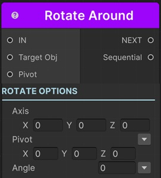

# Rotate Around Sequential

This sequential rotates a transform around another transform or a pivot point with animation.

!!! note "Base Properties"
    To learn about the common Base Properties, please see [Base Sequential](../sequential_base.md)

!!! note "Target Object Options"
    This sequential derives from __Object Returner Sequential__ and gets all its properties from that sequential. So, to learn about the __Target Object Options__ please see [Object Returner Sequential](../sequentialobjectreturner/index.md)

!!! note "Animation Options"
    This sequential derives from __Animation Sequential__ and gets all of its properties. So, to learn about the __Animation Options please see [Animation Base](index.md)
    
## Axis

This lets you define on which axis to rotate the target transform.

For example, to rotate around X and Z set it to (1,0,1)

## Pivot

The target transform will rotate around this point.

It's possible to assign different kind of values to this property (e.g. directly, randomly, from variable or select another transform to rotate around).

!!! info
    To learn more about assigning values with different options, see [Value Assign](../../valueassign.md)

!!! tip
    When you assign Pivot with __Sequential__ option, you need to connect the related sequential's Sequential output port to this sequential's __Pivot input port__.

## Angle

This is the rotation angle in degrees.

It's possible to assign different kind of values to this property (e.g. directly, randomly, from variable).
