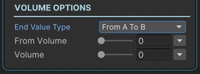

# Change Audio Volume Sequential

This sequential lets you change the volume level of an Audio Source component with animation.

!!! note "Base Properties"
    To learn about the common Base Properties, please see [Base Sequential](../sequential_base.md)

!!! note "Target Object Options"
    This sequential derives from __Object Returner Sequential__ and gets all its properties from that sequential. So, to learn about the __Target Object Options__ please see [Object Returner Sequential](../sequentialobjectreturner/index.md)

!!! note "Animation Options"
    This sequential derives from __Animation Sequential__ and gets all of its properties. So, to learn about the __Animation Options please see [Animation Base](../animationsequentials/index.md)

!!! warning "Target Object"
 
    Target Object (or Target Objects if Multiple Objects are returned) needs to be Audio Source type. So please make sure that the game object assigned in this field has an Audio Source component attached. Otherwise you'll see a runtime error log when this sequential plays.

## End Value Type

This option determines the calculation of the end value of the volume.

### Initial to Value

This changes the volume from its initial value (the value before this sequential starts) to the __Volume__.

### From Value to Initial

This instantly sets the volume to the __Volume__ property and then changes it to its initial value again.

### Initial Plus Value

This adds __Volume__ to the target audio source's initial volume and changes it to the calculated value.

### Initial Multiply Value

This multiplies audio source's initial volume with the __Volume__ and changes the target audio source volume to the calculated value.

### From A to B

This lets you define the starting volume and end volume of the animation independent from the initial volume of the target audio source.

## Volume

This is the Volume value that determines the end volume in accordance with the __End Value Type__ option as explained above.

It's possible to assign different kind of values to this property (e.g. directly, randomly, from variable).

!!! info
    To learn more about assigning values with different options, see [Value Assign](../../valueassign.md)

## From Volume

This is only available when the __End Value Type__ is __From A to B__.

This is the starting volume value of the animation.