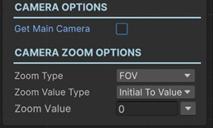

# Zoom Camera Sequential

This sequential lets you zoom in/out a camera with animation.

!!! note "Base Properties"
    To learn about the common Base Properties, please see [Base Sequential](../sequential_base.md)

!!! note "Target Object Options"
    This sequential derives from __Object Returner Sequential__ and gets all its properties from that sequential. So, to learn about the __Target Object Options__ please see [Object Returner Sequential](../sequentialobjectreturner/index.md)

!!! note "Animation Options"
    This sequential derives from __Animation Sequential__ and gets all of its properties. So, to learn about the __Animation Options please see [Animation Base](index.md)

!!! warning "Target Object"
 
    Target Object (or Target Objects if Multiple Objects are returned) needs to be Camera type. So please make sure that the game object assigned in this field has a Camera component attached. Otherwise you'll see a runtime error log when this sequential plays.

## Get Main Camera

If checked, the camera to zoom will be the main camera of the scene (__Camera.main__). 

Otherwise, the camera(s) will be gotten from the __Target Object(s)__.

## Zoom Type

You can select the method of zooming.

### FOV

This will zoom in/out the camera by changing its FOV value. 

If the camera projection is Perspective, you can select this option for zooming.

### Orthographic Size

This will zoom in/out the camera by changing its Size value.

If the camera projection is Orthographic, you can select this option for zooming.

### Depth

This will zoom in/out the camera by changing its Z position.

This option is more suitable for Perspective projection camera but you can use it for Orthographic camera too for some effects.

## Zoom Value Type

This option determines the calculation of the end value of the zoom action.

### Initial to Value

This zooms the target camera from its initial value (the value before this sequential starts) to the __Zoom Value__.

### From Value to Initial

This instantly sets the zoom of the target camera to the __Zoom Value__ and then zooms it to its initial value again.

### Initial Plus Value

This adds __Zoom Value__ to the target camera's initial zoom value and zoom it to the calculated value.

### Initial Multiply Value

This multiplies camera's initial zoom value with the __Zoom Value__ and zooms the target camera to the calculated value.

### From A to B

This lets you define the starting zoom and end zoom of the animation independent from the initial zoom of the target camera.

## Zoom Value

This is the value that determines the end zoom value in accordance with the __Zoom Value Type__ option as explained above.

It's possible to assign different kind of values to this property (e.g. directly, randomly, from variable).

!!! info
    To learn more about assigning values with different options, see [Value Assign](../../valueassign.md)
 

## From Zoom Value

This is only available when the __Zoom Value Type__ is __From A to B__.

This is the starting zoom value of the zoom animation.
 
