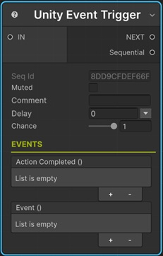

# Unity Event Trigger

This sequential lets you call methods from your scripts via Unity Event mechanism.

!!! note "Base Properties"
    To learn about the common Base Properties, please see [Base Sequential](../sequential_base.md)

## Event()

This is the Unity Event to trigger.
