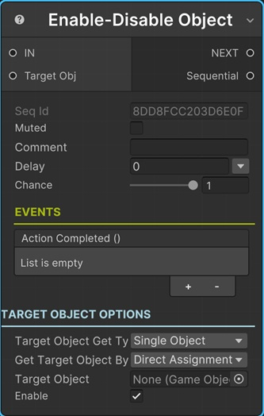

# Enable/Disable Object Sequential

This sequential enables or disables a Unity game object (Target Object) with or without delay.

!!! note "Base Properties"
    To learn about the common Base Properties, please see [Base Sequential](../sequential_base.md)

!!! note "Target Object Options"
    This sequential derives from __Object Returner Sequential__ and gets all its properties from that sequential. So, to learn about the __Target Object Options__ please see [Object Returner Sequential](../sequentialobjectreturner/index.md)

## Enable

If this is checked, it will enable the game object.

If not checked, it will disable the game object.

