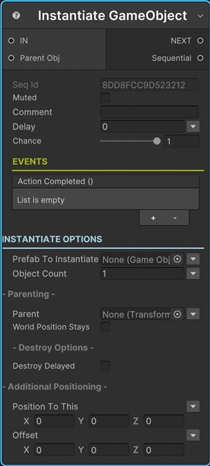
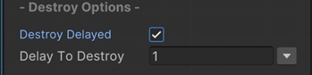
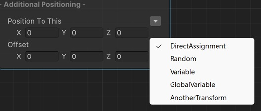

# Instantiate Sequential

This sequential instantiate a Unity game object from a prefab.

!!! note "Base Properties"
    To learn about the common Base Properties, please see [Base Sequential](../sequential_base.md)

## Prefab to Instantiate

This is the prefab to instantiate.

You can select the prefab directly, or you can select a random prefab from a list of prefabs, or you can get the prefab from a variable or global variable.

!!! info
    To learn more about assigning values with different options, see [Value Assign](../../valueassign.md)

## Object Count

This defines how many objects to instantiate from the prefab. 

!!! note
    If you assign a value greater than 1, the __Sequential output port__ exposes an array of game objects instead of a single game object.

## Delay Between Each Object

If the __Object Count__ is greater than 1, you can define a delay value (in seconds) to wait between each object instantiate.

## Parenting

This section lets you define the parenting options of the instantiated game object.

### Parent

The instantiated object(s) will be the child(ren) of this Parent transform.

### World Position Stays

When the instantiated object became a child of the Parent transform, this defines the position of the game object after parenting.

So, if this is enabled, the world position of the game object stays same. Otherwise, it will be positioned according to its new Parent transform.

## Destroy Options

### Destroy Delayed

When this option is enabled, the instantiated object will be destroyed after a certian time.

### Delay to Destroy

If the Destroy Delayed is enabled, the instantiated object will be destroyed after seconds that is defined in this property.

## Additional Positioning

This group lets you define the position of the instantiated object.

### Position to This

This will be the position of the instantiated object.

You can enter a direct Vector3 value, or select a random position from a range, or get the Vector3 value from a variable or global variable, or you can position it to the same position of another transform.

!!! info
    To learn more about assigning values with different options, see [Value Assign](../../valueassign.md)

### Offset

This value will be added to the position of the instantiated game object. 

