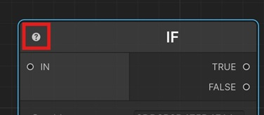

# All Sequentials

In this section, you can find all the Sequentials that can be used in Sequentior.

## What is a Sequential?

Sequential is the base entity that performs a task in a sequence flow of a Sequentior Manager.

## Description of Sequentials

You can see the description of each sequential by clicking the question mark icon on the top left corner of nodes.

