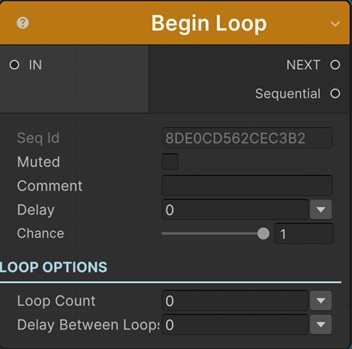

# Loop Sequentials

To loop through a series of sequentials you need to use __Begin Loop__ and __End Loop__ sequentials.

This is very similar to a traditional For Block in programming.

!!! tip
    Loop is different from the Repeat Options of [Animation Sequentials](../animationsequentials/index.md). While Repeat is for repeating single sequential, Loop is for repeating a series of sequentials as a group.

!!! note "Base Properties"
    To learn about the common Base Properties, please see [Base Sequential](../sequential_base.md)

## Loop Count

Every sequential between __Begin Loop__ and __End Looop__ sequentials will play a number of times which is defined in Loop Count.

It's possible to assign different kind of values to this property (e.g. directly, randomly, from variable).

!!! info
    To learn more about assigning values with different options, see [Value Assign](../../valueassign.md)

## Delay Between Loops

How many seconds to wait between each loop.

## End Loop

For every __Begin Loop__ sequential, you need to add an __End Loop__ sequential which defines the scope of the loop. 

!!! warning
    Nested loops are not supported.

