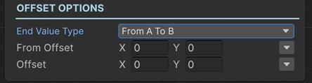

# Material Texture Offset Animator Sequential

This sequential lets you modify the placement offset of a given texture of a material.

!!! note "Base Properties"
    To learn about the common Base Properties, please see [Base Sequential](../sequential_base.md)

!!! note "Target Object Options"
    This sequential derives from __Object Returner Sequential__ and gets all its properties from that sequential. So, to learn about the __Target Object Options__ please see [Object Returner Sequential](../sequentialobjectreturner/index.md)

!!! note "Animation Options"
    This sequential derives from __Animation Sequential__ and gets all of its properties. So, to learn about the __Animation Options please see [Animation Base](../animationsequentials/index.md)

!!! note "Material Options"
    This sequential derives from __Material Sequential__ and gets all of its properties. So, to learn about the __Material Options__ please see [Material Base](index.md)

## End Value Type

This option determines the calculation of the end value of the offset.

### Initial to Value

This modifies the target texture offset from its initial offset (the value before this sequential starts) to the __Offset__.

### From Value to Initial

This sets the target texture offset to the __Offset__ and then modifies it to its initial offset again.

### Initial Plus Value

This adds __Offset__ to the target texture's initial offset and modifies it to the calculated end offset.

### Initial Multiply Value

This multiplies the texture's initial offset with the __Offset__ and modifies the target texture's offset to the calculated value.

### From A to B

This lets you define the starting offset and end offset of the animation independent from the initial offset of the texture.

## Offset

This is the Vector2 offset that determines the end value in accordance with the __End Value Type__ option as explained above.

It's possible to assign different kind of values to this property (e.g. directly, randomly, from variable).

!!! info
    To learn more about assigning values with different options, see [Value Assign](../../valueassign.md)
 

## From Offset

This is only available when the __End Value Type__ is __From A to B__.

This is the starting offset of the animation.
