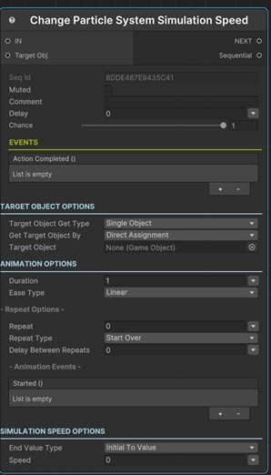

# Change Particle System Simulation Speed

This sequential lets you modify the simulation speed of a Particle System with animation.

!!! note "Base Properties"
    To learn about the common Base Properties, please see [Base Sequential](../sequential_base.md)

!!! note "Target Object Options"
    This sequential derives from __Object Returner Sequential__ and gets all its properties from that sequential. So, to learn about the __Target Object Options__ please see [Object Returner Sequential](../sequentialobjectreturner/index.md)

!!! note "Animation Options"
    This sequential derives from __Animation Sequential__ and gets all of its properties. So, to learn about the __Animation Options please see [Animation Base](../animationsequentials/index.md)

!!! warning "Target Object"
 
    Target Object (or Target Objects if Multiple Objects are returned) needs to be type of __Particle System__. So please make sure that the game object assigned in this field has the Particle System component attached. Otherwise you'll see a runtime error log when this sequential plays. 

## End Value Type

This option determines the calculation of the end value of the simulation speed.

### Initial to Value

This changes the simulation speed from its initial value (the value before this sequential starts) to the __Speed__.

### From Value to Initial

This sets the simulation speed to the __Speed__ and then changes it to its initial value again.

### Initial Plus Value

This adds __Speed__ to the initial simulation speed and changes it to the calculated value.

### Initial Multiply Value

This multiplies the simulation speed's initial value with the  __Speed__ and changes the to the calculated value.

### From A to B

This lets you define the starting speed and end speed of the animation independent from the initial value of the simulation speed.

## Speed

This is the value that determines the end simulation speed in accordance with the __End Value Type__ option as explained above.

It's possible to assign different kind of values to this property (e.g. directly, randomly, from variable).

!!! info
    To learn more about assigning values with different options, see [Value Assign](../../valueassign.md)