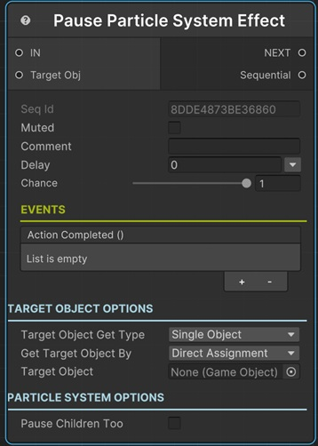

# Pause Particle System Effect

This sequential pauses an already running Particle System effect.

!!! note "Base Properties"
    To learn about the common Base Properties, please see [Base Sequential](../sequential_base.md)

!!! note "Target Object Options"
    This sequential derives from __Object Returner Sequential__ and gets all its properties from that sequential. So, to learn about the __Target Object Options__ please see [Object Returner Sequential](../sequentialobjectreturner/index.md)

!!! warning "Target Object"
 
    Target Object (or Target Objects if Multiple Objects are returned) needs to be type of __Particle System__. So please make sure that the game object assigned in this field has the Particle System component attached. Otherwise you'll see a runtime error log when this sequential plays. 

## Pause Children Too

If enabled, it will pause the children particle systems too.