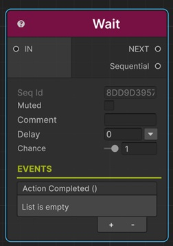

# Wait Sequential

This sequential holds all the sequentials after itself until the sequentials before itself has been completed.

!!! note "Base Properties"
    To learn about the common Base Properties, please see [Base Sequential](../sequential_base.md)

!!! warning
    Wait inside a [loop](../loopsequentials/index.md) is not supported.
    