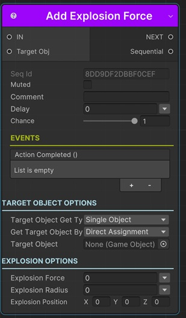

# Add Explosion Force Sequential

This sequential applies force to a __Rigidbody__ component that simulates explosion effects.

!!! note "Base Properties"
    To learn about the common Base Properties, please see [Base Sequential](../sequential_base.md)

!!! note "Target Object Options"
    This sequential derives from __Object Returner Sequential__ and gets all its properties from that sequential. So, to learn about the __Target Object Options__ please see [Object Returner Sequential](../sequentialobjectreturner/index.md)

!!! warning "Target Object"
 
    Target Object (or Target Objects if Multiple Objects are returned) needs to be Rigidbody2D type. So please make sure that the game object assigned in this field has a Rigidbody2D component attached. Otherwise you'll see a runtime error log when this sequential plays.

## Explosion Force

The force of the explosion effect.

_It's possible to assign different kind of values to this property (e.g. directly, randomly, from variable)._

!!! info
    To learn more about assigning values with different options, see [Value Assign](../../valueassign.md)
 

## Explosion Radius

 The radius of the sphere within which the explosion has its effect.

 _It's possible to assign different kind of values to this property (e.g. directly, randomly, from variable)._

!!! info
    To learn more about assigning values with different options, see [Value Assign](../../valueassign.md)

## Explosion Position

 The center of the sphere within which the explosion has its effect.