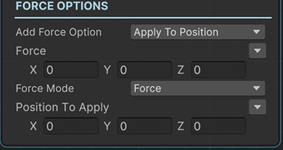

# Add Force 2d Sequential

This sequential adds force to a __Rigidbody2D__ component with animation.

!!! note "Base Properties"
    To learn about the common Base Properties, please see [Base Sequential](../sequential_base.md)

!!! note "Target Object Options"
    This sequential derives from __Object Returner Sequential__ and gets all its properties from that sequential. So, to learn about the __Target Object Options__ please see [Object Returner Sequential](../sequentialobjectreturner/index.md)

!!! note "Animation Options"
    This sequential derives from __Animation Sequential__ and gets all of its properties. So, to learn about the __Animation Options please see [Animation Base](index.md)

!!! warning "Target Object"
 
    Target Object (or Target Objects if Multiple Objects are returned) needs to be Rigidbody2D type. So please make sure that the game object assigned in this field has a Rigidbody2D component attached. Otherwise you'll see a runtime error log when this sequential plays.

## Add Force Option

This option defines how to apply the force.

### Standard

This applies a force to the rigidbody by calling its AddForce() method.

### Relative

This applies a force to the rigidbody relative to its coordinate system by calling AddRelativeForce() method.

### Apply To Position

This applies a force at a position so it applies a torque and force on the rigidbody.

## Force

This is the force to be applied to the rigidbody.

It's possible to assign different kind of values to this property (e.g. directly, randomly, from variable).

!!! info
    To learn more about assigning values with different options, see [Value Assign](../../valueassign.md)
 

## Force Mode

* __Force__: Add a continuous force to the rigidbody by using its mass.
* __Impulse__: Add an instant force impulse to the rigidbody by using its mass.

## Position to Apply

This is only available when the __Add Force Option__ is __Apply To Position__.

This is the position to apply force in world coordinates.

