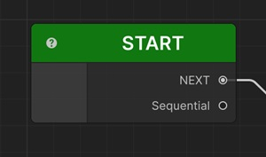

# Start Sequential

Start Sequential is the entry point of a Sequentior Graph. Every graph needs to have one Start Sequential.

When you open the Sequentior Graph Editor for the first time, Start Sequential will be added automatically for you. But you can add it manually too if you've removed it.

