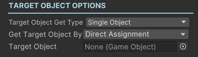
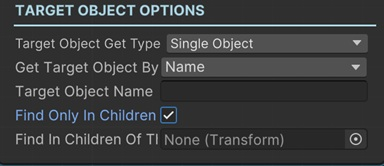
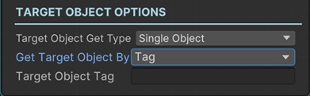
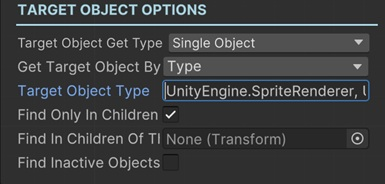
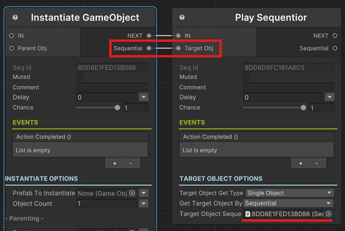
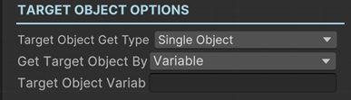
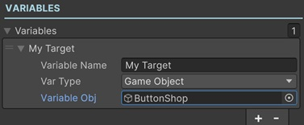

# Getting Single Target Object

In this section, you'll find information about getting a single game object to be used as the Target Object in most of the sequentials.

### Get Target Object By

This option lets you choose how to find the target object. There are a few options to choose from and each of them has its own properties.

### Direct Assignment

This lets you select a single game object as the target object from the scene.

#### Target Object

This is used to assign a single target object directly.

!!! note
    If you forgot to assign a Target Object, the parent Sequentior Manager gameobject will be assigned automatically as the target object. But this will throw a warning in console.

### Parent Sequentior

This sets the parent sequentior manager of this sequential as the target object.

### By Name

This lets you find a single target game object by its name.

#### Target Object Name

This is the name of the game object to find from the scene. The first game object with this name will be returned.

#### Find Only In Children

If this is enabled, it tries to find the target object from child game objects of the game object that this sequential is attached to.

#### Find In Children Of This

This is only available when Find Only In Children is enabled.

If nothing is assigned to this field, it tries to find in children of the game object this sequential is attached to.

If you assign another game object here, it will try to find in children of that assigned game object.

### By Tag

This lets you find a single target game object by its tag.

#### Target Object Tag

This is the tag of the game object to find from the scene. The first game object with this tag will be returned.

### By Type

This lets you find a single target game object by its class type.

#### Target Object Type
This is the class name with full namespace of a component that is attached to the target object.

So, for example, to find a game object with SpriteRenderer component attached, you need to type _UnityEngine.SpriteRenderer, UnityEngine_.

!!! note "What's full type?"
    * For custom types, you can use the full class name with namespace. e.g. com.kerimkaynakcigames.MyGame.GameManager
    * For built-in types, write the class name and then put a comma (,) and then assembly name. e.g. UnityEngine.SpriteRenderer, UnityEngine

#### Find Only In Children
See [Find Only In Children](#find-only-in-children)

#### Find In Children Of This
See [Find In Children Of This](#find-in-children-of-this)

#### Find Inactive Objects Too
By default, only the first active object is returned as the target object. But to search in inactive objects too, enable this option.

### By Sequential

This lets you get the target object from another sequential's returned game object.

Some sequentials return game objects and expose this returned game object to their Sequential output pin. e.g. Instantiate Sequential or Find Object Sequential.

So, to get these returned game objects as the target of another sequential, choose this option and connect the __Sequential output pin__ of other sequential to the __Target Obj input pin__ of this sequential. 

#### Target Object Sequential
This is the sequential that will return the game object as the target object.
!!! warning
    Do not assign this field manually. This is automatically assigned when you connect another sequential's Sequential output pin to this sequential's Target Obj input pin.

### By Variable

This lets you get the target object from a variable of parent Sequentior Manager of this sequential.

#### Target Object Variable
Enter a variable name of type __Game Object__.
This variable needs to be in the Variables List of parent Sequentior Manager.

!!! info
    See [Variables](../../variables/index.md) for more information about variables.
