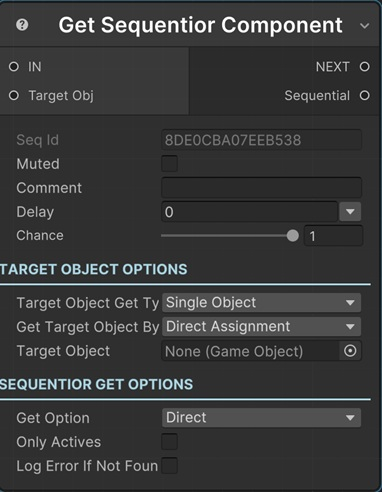

# Get Sequentior Manager Component

This sequential gets Sequentior Manager component from target object and returns it in Sequential output pin.

!!! note "Base Properties"
    To learn about the common Base Properties, please see [Base Sequential](../sequential_base.md)

!!! note "Target Object Options"
    This sequential derives from __Object Returner Sequential__ and gets all its properties from that sequential. So, to learn about the __Target Object Options__ please see [Object Returner Sequential](../sequentialobjectreturner/index.md)

!!! warning "Target Object"
 
    Target Object (or Target Objects if Multiple Objects are returned) or at least one of its childs needs to be type of __Sequentior Manager__. So please make sure that the game object assigned in this field has the Sequentior Manager component attached or a child game object that has Sequentior Manager component. Otherwise you'll see a runtime error log when this sequential plays. 

## Get Option

This option defines how to get the Sequentior Manager from target object.

* __Direct:__ Tries to get the Sequentior Manager component directly from the target object. This assumes the target object has Sequentior Manager component attached.
* __By Name:__ Tries to find a child gameobject of the target object and gets the Sequentior Manager component attached to this child.
* __First Child:__ Gets the first child gameobject of the target object and gets the Sequentior Manager component attached to this child.

## Child Name

If the __Get Option__ is set to __By Name__, this field is the child name to find.

## Only Actives

If enabled, it will search only active child gameobjects. Otherwise inactive child gameobject can be returned too.

## Log Error If Not Found

If no Sequentior Manager component found in target gameobject, it will print an error log when this option is enabled.