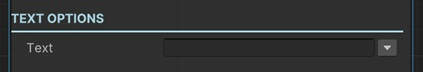

# Change Text Sequential

This sequential changes the text of a TextMesPro component immediately.

!!! note "Base Properties"
    To learn about the common Base Properties, please see [Base Sequential](../sequential_base.md)

!!! note "Target Object Options"
    This sequential derives from __Object Returner Sequential__ and gets all its properties from that sequential. So, to learn about the __Target Object Options__ please see [Object Returner Sequential](../sequentialobjectreturner/index.md)

!!! warning "Target Object"
 
    Target Object (or Target Objects if Multiple Objects are returned) needs to be TextMeshPro type. So please make sure that the game object assigned in this field has a TextMeshPro component attached. Otherwise you'll see a runtime error log when this sequential plays.

!!! warning
    Please note that although this sequential derives from __Animation Base__ sequential, it does not apply any animation while setting the text. It assigns the text immediately.

## Text

Text to assign.

It's possible to assign different kind of values to this property (e.g. directly, randomly, from variable).

!!! info
    To learn more about assigning values with different options, see [Value Assign](../../valueassign.md)
 