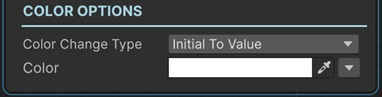

# Change Text Outline Color Sequential

This sequential changes the outline color of a TextMeshPro with animation.

!!! note "Base Properties"
    To learn about the common Base Properties, please see [Base Sequential](../sequential_base.md)

!!! note "Target Object Options"
    This sequential derives from __Object Returner Sequential__ and gets all its properties from that sequential. So, to learn about the __Target Object Options__ please see [Object Returner Sequential](../sequentialobjectreturner/index.md)

!!! note "Animation Options"
    This sequential derives from __Animation Sequential__ and gets all of its properties. So, to learn about the __Animation Options please see [Animation Base](index.md)

!!! warning "Target Object"
 
    Target Object (or Target Objects if Multiple Objects are returned) needs to be TextMeshPro type. So please make sure that the game object assigned in this field has a TextMeshPro component attached. Otherwise you'll see a runtime error log when this sequential plays.

## Color Change Type

This option determines the calculation of the end color.

### Initial to Value

This changes the outline color of the target text from its initial value (the value before this sequential starts) to the __Color__ value.

### From Value to Initial

This instantly sets the outline color of the target text to the __Color__ and then modifies it to its initial value again with animation.

### Initial Plus Value

This adds __Color__ to the target text's initial outline color value and changes it to the calculated value.
 

### Initial Multiply Value

This multiplies each component (R,G,B,A) of the text's initial outline color with the corresponding component of the __Color__ and changes the target text outline color to the calculated color value.

### From A to B

This lets you define the starting outline color and end outline color of the animation independent from the initial outline color of the target text.

## Color

This is the Color value that determines the end outline color in accordance with the __Color Change Type__ option as explained above.

It's possible to assign different kind of values to this property (e.g. directly, randomly, from variable).

!!! info
    To learn more about assigning values with different options, see [Value Assign](../../valueassign.md)

## From Color

This is only available when the __Color Change Type__ is __From A to B__.

This is the starting outline color value of the animation.
