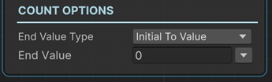

# Count Number on Text Sequential

Counts from a number to another number and sets the value to the TMP Text component's text.

So basically, this is a counting animation.

!!! note "Base Properties"
    To learn about the common Base Properties, please see [Base Sequential](../sequential_base.md)

!!! note "Target Object Options"
    This sequential derives from __Object Returner Sequential__ and gets all its properties from that sequential. So, to learn about the __Target Object Options__ please see [Object Returner Sequential](../sequentialobjectreturner/index.md)

!!! note "Animation Options"
    This sequential derives from __Animation Sequential__ and gets all of its properties. So, to learn about the __Animation Options please see [Animation Base](index.md)

!!! warning "Target Object"
 
    Target Object (or Target Objects if Multiple Objects are returned) needs to be TextMeshPro type. So please make sure that the game object assigned in this field has a TextMeshPro component attached. Otherwise you'll see a runtime error log when this sequential plays.

## End Value Type

This option determines the calculation of the end value of the number.

### Initial to Value

This gets the number from TMPText's text value then modifies the number from its initial value (the value before this sequential starts) to the __End Value__.

### From Value to Initial

This sets the number to the __End Value__ and then modifies it to its initial value again.

### Initial Plus Value

This gets the number from TMPText's text value then adds __End Value__ to the initial number and modifies it to the calculated end value.

### Initial Multiply Value

This gets the number from TMPText's text value then multiplies the initial number with the __End Value__ and modifies the it to the calculated value.

### From A to B

This lets you define the starting number and end number of the count animation independent from the initial text of the TMPText component.

## End Value

This is the value that determines the end number in accordance with the __End Value Type__ option as explained above.

It's possible to assign different kind of values to this property (e.g. directly, randomly, from variable).

!!! info
    To learn more about assigning values with different options, see [Value Assign](../../valueassign.md)
 

## Start Value

This is only available when the __End Value Type__ is __From A to B__.

This is the starting number value of the animation.
