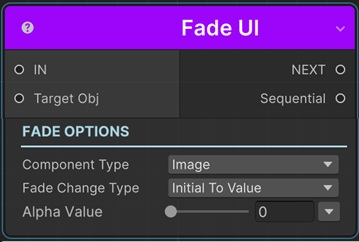
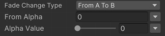

# Fade UI

This sequential lets you fade a UI element by modifying its Alpha value with animation.

!!! note "Base Properties"
    To learn about the common Base Properties, please see [Base Sequential](../sequential_base.md)

!!! note "Target Object Options"
    This sequential derives from __Object Returner Sequential__ and gets all its properties from that sequential. So, to learn about the __Target Object Options__ please see [Object Returner Sequential](../sequentialobjectreturner/index.md)

!!! note "Animation Options"
    This sequential derives from __Animation Sequential__ and gets all of its properties. So, to learn about the __Animation Options please see [Animation Base](../animationsequentials/index.md)

## Component Type

Which type of component do you want to fade?

* __Image:__ If the gameobject you want to fade has the UI Image component, select this option.
* __Canvas Group:__ If the gameobject you want to fade has the Canvas Group component, select this option.
* __Text:__ If the gameobject you want to fade has the TMPText component, select this option.

## Fade Change Type

This option determines the calculation of the end value of the fade.

### Initial to Value

This fades the target transform from its initial value (the value before this sequential starts) to the __Alpha Value__.

### From Value to Initial

This sets the alpha of target transform to the __Alpha Value__ and then changes it to its initial value again.

### Initial Plus Value

This adds __Alpha Value__ to the target transform's initial alpha value and changes it to the calculated alpha value.

### Initial Multiply Value

This multiplies the transform's initial alpha value with the  __Alpha Value__ and changes the target transform's alpha to the calculated value.

### From A to B

This lets you define the starting alpha and end alpha of the fade animation independent from the initial alpha of the target transform.

## Alpha Value

This is the value that determines the end transparency of the target gameobject in accordance with the __Fade Change Type__ option as explained above.

It's possible to assign different kind of values to this property (e.g. directly, randomly, from variable).

!!! info
    To learn more about assigning values with different options, see [Value Assign](../../valueassign.md)

## From Alpha

This is only available when the __Fade Change Type__ is __From A to B__.

This is the starting alpha value of the fade animation.

