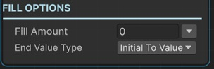

# Fill UI Image

This sequential lets you fill a UI image element by modifying its FillAmount value with animation.

!!! warning
    The UI Image game object's Image Type property should be set to Filled to make this sequential work.

!!! note "Base Properties"
    To learn about the common Base Properties, please see [Base Sequential](../sequential_base.md)

!!! note "Target Object Options"
    This sequential derives from __Object Returner Sequential__ and gets all its properties from that sequential. So, to learn about the __Target Object Options__ please see [Object Returner Sequential](../sequentialobjectreturner/index.md)

!!! note "Animation Options"
    This sequential derives from __Animation Sequential__ and gets all of its properties. So, to learn about the __Animation Options please see [Animation Base](../animationsequentials/index.md)

!!! warning "Target Object"
 
    Target Object (or Target Objects if Multiple Objects are returned) needs to be Image (UI) type. So please make sure that the game object assigned in this field has an Image component attached. Otherwise you'll see a runtime error log when this sequential plays.

## End Value Type

This option determines the calculation of the end value of the fill amount.

### Initial to Value

This fills the target image from its initial fill amount value (the value before this sequential starts) to the __Fill Amount__.

### From Value to Initial

This sets the fill amount of target image to the __Fill Amount__ and then changes it to its initial value again.

### Initial Plus Value

This adds __Fill Amount__ to the target image's initial fill amount value and changes it to the calculated fill amount value.

### Initial Multiply Value

This multiplies the image's initial fill amount value with the  __Fill Amount__ and changes the target image's fill amount to the calculated value.

### From A to B

This lets you define the starting fill amount and end fill amount of the animation independent from the initial fill amount of the target image.

## Fill Amount

This is the value that determines the end fill amount of the target image in accordance with the __End Value Type__ option as explained above.

It's possible to assign different kind of values to this property (e.g. directly, randomly, from variable).

!!! info
    To learn more about assigning values with different options, see [Value Assign](../../valueassign.md)

## From Fill Amount

This is only available when the __End Value Type__ is __From A to B__.

This is the starting fill amount value of the animation.

