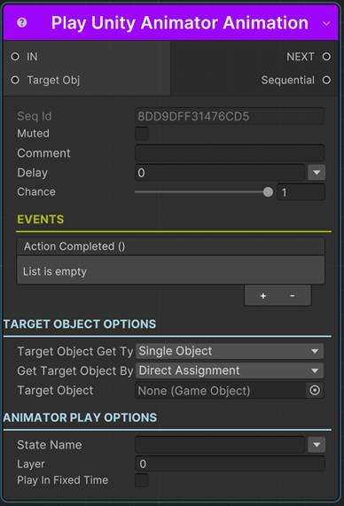

# Play Unity Animator Animation Sequential

This sequentials plays a Unity animation state.

!!! note "Base Properties"
    To learn about the common Base Properties, please see [Base Sequential](../sequential_base.md)

!!! note "Target Object Options"
    This sequential derives from __Object Returner Sequential__ and gets all its properties from that sequential. So, to learn about the __Target Object Options__ please see [Object Returner Sequential](../sequentialobjectreturner/index.md)

!!! warning "Target Object"
 
    Target Object (or Target Objects if Multiple Objects are returned) needs to be Animator type. So please make sure that the game object assigned in this field has an Animator component attached. Otherwise you'll see a runtime error log when this sequential plays.

## State Name

State name to play.

_It's possible to assign different kind of values to this property (e.g. directly, randomly, from variable)._

!!! info
    To learn more about assigning values with different options, see [Value Assign](../../valueassign.md)
 

## Layer 

Layer index.

## Play in Fixed Time

If checked, it plays the animation in sync with FixedUpdate.

## Fixed Time

Time offset in seconds.

This is only available if __Play in Fixed Time__ is checked.

