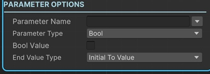

# Set Animator Parameter Sequential

This sequential lets you set a value to an animator parameter.

!!! note "Base Properties"
    To learn about the common Base Properties, please see [Base Sequential](../sequential_base.md)

!!! note "Target Object Options"
    This sequential derives from __Object Returner Sequential__ and gets all its properties from that sequential. So, to learn about the __Target Object Options__ please see [Object Returner Sequential](../sequentialobjectreturner/index.md)

!!! note "Animation Options"
    This sequential derives from __Animation Sequential__ and gets all of its properties. So, to learn about the __Animation Options please see [Animation Base](../animationsequentials/index.md)

!!! warning "Target Object"
 
    Target Object (or Target Objects if Multiple Objects are returned) needs to be Animator type. So please make sure that the game object assigned in this field has an Animator component attached. Otherwise you'll see a runtime error log when this sequential plays.

## Parameter Name

Parameter name to set.

_It's possible to assign different kind of values to this property (e.g. directly, randomly, from variable)._

!!! info
    To learn more about assigning values with different options, see [Value Assign](../../valueassign.md)
 
## Parameter Type

 This is the data type of the parameter. This should match the type of the parameter in the Animator graph.

## Parameter Value

This is the value to assign to the parameter.

This is a dynamic field and it changes according to the __Parameter Type__ property.

_It's possible to assign different kind of values to this property (e.g. directly, randomly, from variable)._

!!! info
    To learn more about assigning values with different options, see [Value Assign](../../valueassign.md)

## End Value Type

This option determines the calculation of the end value of the parameter value.

### Initial to Value

This changes the parameter from its initial value (the value before this sequential starts) to the __Parameter Value__.

### From Value to Initial

This sets the value of parameter to the __Parameter Value__ and then changes it to its initial value again.

### Initial Plus Value

This adds __Parameter Value__ to the initial parameter value and changes it to the calculated  value.

### Initial Multiply Value

This multiplies the parameter's initial value with the  __Parameter Value__ and changes the to the calculated value.

### From A to B

This lets you define the starting value and end value of the animation independent from the initial value of the parameter.