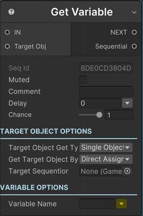

# Get Variable Sequential

This sequential finds a variable from the Parent Sequentior's Variables List and returns it as the __Sequential Output port__.

Most of the time you won't need this sequential because sequential properties that a variable can be assigned to have it own variable assigning mechanism.

!!! note "Base Properties"
    To learn about the common Base Properties, please see [Base Sequential](../sequential_base.md)

## Variable Name

The variable name to find in the Parent Sequentior's Variables List.

!!! tip
    You can select a variable of __parent__ Sequentior Manager by clicking the yellow arrow in this field. This is just for entering the variable name easily. You can always type any variable name to the field also.

