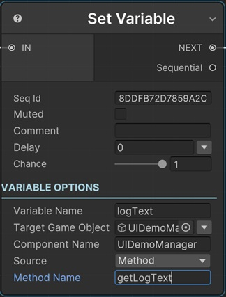

# Set Variable Sequential

This sequential finds a variable from the Parent Sequentior's Variables List and sets its value from script.

!!! note "Base Properties"
    To learn about the common Base Properties, please see [Base Sequential](../sequential_base.md)

## Variable Name

The variable name to set in the Parent Sequentior's Variables List. This variable should be defined in parent Sequentior.

!!! tip
    You can select a variable of __parent__ Sequentior Manager by clicking the yellow arrow in this field. This is just for entering the variable name easily. You can always type any variable name to the field also.

## Target GameObject

This is the gameobject that has the script that will be used to get the new value of variable.

## Component Name

This is the class name with full namespace of a component that is attached to the target object.

So, for example, to call a method of a SpriteRenderer component attached, you need to type _UnityEngine.SpriteRenderer, UnityEngine_.

!!! note "What's full type?"
    * For custom types, you can use the full class name with namespace. e.g. com.kerimkaynakcigames.MyGame.GameManager
    * For built-in types, write the class name and then put a comma (,) and then assembly name. e.g. UnityEngine.SpriteRenderer, UnityEngine

## Source

There are two types of sources to get the value from the target gameobject.

* __Method__ : Calls a method from component script.
* __Field__ : Gets a field value from component script.

## Method Name

This is the name of the method to call from component script. This method should return the same data type as the sequentior variable we're going to set a value to.

## Field Name

This is the name of the field to read from component script. This field should have the same data type as the sequentior variable we're going to set a value to.

