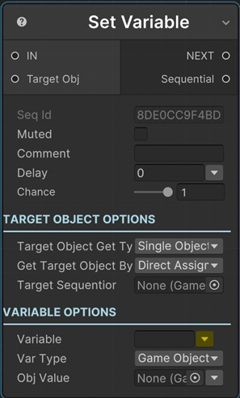

# Set Variable Directly

This sequential finds a variable from the target Sequentior Manager's Variables List and sets its value directly.

!!! note "Base Properties"
    To learn about the common Base Properties, please see [Base Sequential](../sequential_base.md)

!!! note "Target Object Options"
    This sequential derives from __Object Returner Sequential__ and gets all its properties from that sequential. So, to learn about the __Target Object Options__ please see [Object Returner Sequential](../sequentialobjectreturner/index.md)

## Variable

The variable name to set in the target Sequentior Manager's Variables List. This variable should be defined in target Sequentior.

!!! tip
    You can select a variable of __parent__ Sequentior Manager by clicking the yellow arrow in this field. This is just for entering the variable name easily. You can always type any variable name to the field also.

## Var Type

The data type of the value to assign to the variable. 

Typically, this will be the same data type as the variable's data type defined in the target sequentior manager variable list.

## Value

This is the value to set as the new value of the __Variable__.

This field changes dynamically by the Var Type option. 
