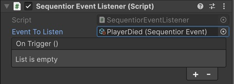

# Sequentior Event

Sequentior Event is simple yet powerful mechanism that lets multiple game objects listen to some events in your scripts without any dependency.

For example, when a player character hit by enemy, you might need to tell the UI Manager to update its health progress bar. But this makes the player character dependent to UI manager.
Instead, you can create a Sequentior Event asset for player hit and let UI Manager listens to this event and player character triggers this event when needed. This way, there will be no dependency between these objects. Moreover, multiple game objects might listen to the same event and performs their own logic when the event triggers.

Sequentior Events are different from traditional Unity Events. These are ScriptableObjects that can be created and saved as assets and can be used throughout the whole project.

To create a new Sequentior Event, just right click on your Project window and select __Create->Sequentior->Sequentior Event__. The only thing you need to do is to choose a name for your event and that's it.

Here's an example to trigger this event from your code:

``` C#
        // The SequentiorEvent asset reference to trigger
        public SequentiorEvent PlayerDiedEvent;

        void playerDied()
        {
         // ... player die logic ...
         // and then trigger the event without caring about who listens to this event
         PlayerDiedEvent?.Trigger();
        }
```

## Sequentior Event Listener



The game objects that listens to a Sequentior Event need to have __Sequentior Event Listener__ component attached.

### Event To Listen

This is the Sequentior Event asset to listen to.

### On Trigger()

When the __Event To Listen__ event is triggered, the methods you add here will be called.
