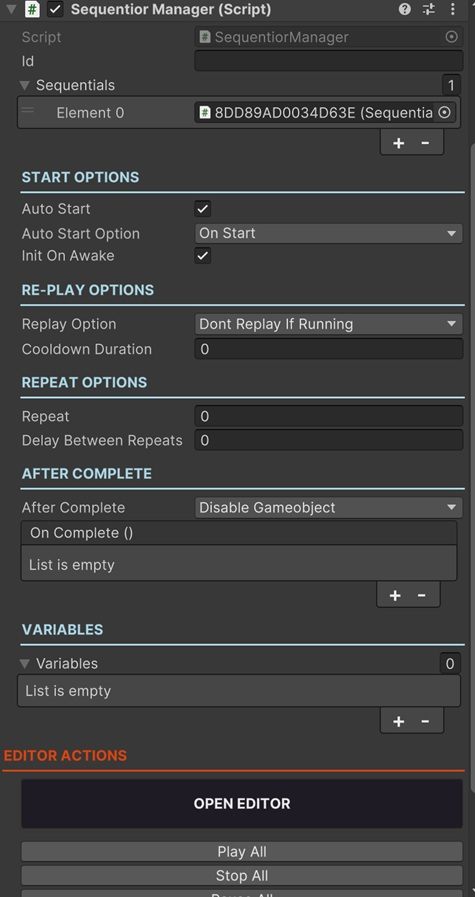

# Sequentior Manager

Sequentior Manager is the main component that is responsible for managing all the Sequentials to perform a task.

Sequentials are kind of single task performing sequence nodes that can be connected to each other inside a Sequentior Manager Graph to perform more complicated jobs.

!!! note "" 
    You need to add a **Sequentior Manager** component to a **GameObject** to start adding sequentials.



As you see, there are some options to tweak Sequentior Manager.

The most important one is the **Open Editor** button. But let's see the other options first.

### Id

!!! note
    Optional for most cases.

For most of the cases Id stays empty. But when you create a Sequentior (e.g. for an animation) and you make this Sequentior a prefab, you can dynamically load this Sequentior at runtime and play the Sequentior. This is useful for using a single Sequentior in multiple objects.

!!! quote ""
    :octicons-link-16: See [Dynamic Sequentiors](dynamicsequentior.md) to learn how to create sequentior prefabs.

When this kind of dynamic sequentior is needed, you need to define a unique Id.

Another example a unique Id is needed when you need to get a specific Sequentior from your scripts. You can query the Sequentior component by its Id.

## SEQUENTIAL LIST

This is the list of sequentials this Sequentior Manager has. This list is automatically filled by Sequentior Graph Editor so do not add/remove sequentials to/from this list manually. But for some reason when you remove a sequential node from Graph Editor, if  the sequential remains in this list (as a Missing Component) you can remove it from the list manually.

This property is made public for this specific purpose.

!!! warning
    You should not remove the child sequential game objects of the Sequentior Manager manually! If you did so accidentally, you need to remove it from the Sequential List manually too.


## START OPTIONS

Properties in this section lets you tweak how to start (play) the sequentials in this Sequentior Manager.

### Auto Start

If enabled, the Sequentior Manager starts playing all the sequentials automatically.

You can always start sequentials from your scripts:

``` c#
public void SomeMethod(){

    Sequentior_GameOver.StartAllSequentials();

}
```

### Auto Start Option

If Auto Start is enabled, you can choose when Sequentior Manager starts playing its sequentials. 

* __OnStart__: Auto starts sequentials when the gameobject that has the Sequentior Manager component is started (when its' OnStart() method is called)
* __OnEnabled__: Auto starts sequentials when the gameobject that has the Sequentior Manager component is enabled. This is useful for re-playing sequentials when the gameobject is re-enabled after a disabling.  

### Init On Awake

!!! note
    This should almost always be enabled.

This initializes the sequentials by the flow in the Sequentior Graph Editor.

For some situations (especially when an IF Sequential is used), the flow needs to be determined at runtime and some properties of some other dependent components might not be ready yet on Awake(). To overcome the issues of those kinds, you can try to disable this property.

## RE-PLAY OPTIONS

Depending on your task's logic, you can try to play sequentials again even though they are not completed yet. For example; if you create a Sequentior for a player to create some fancy VFX and play some SFX when got damage, you always call the StartAllSequentials() method whenever something hit the player. But you might want to stop the previously playing effects and after that play the new effects, or you might want to play the effects again regardless of the previous ones. This section lets you decide how to play the sequentials again.

!!! quote "Tip"
     Re-Play Options are only effective when you start sequentials from scripts by calling StartAllSequentials() method. Auto Start and repeating ignores re-play options.

### Replay Option

* __Don't Replay If Running__ : This is the default one. Sequentior Manager won't start the sequentials if the previously started sequentials not completed yet.
* __Multiple Run__ : It will start the sequentials again whether or not a previous sequential session is completed.
* __Stop Current and Run__ : It stops the currently running sequential session and restarts them all.

### Cooldown Duration

Sometimes you might need a cooldown duration between multiple runs of the same sequentials even though you try to start sequentials from your scripts. This property sets a cooldown duration (in seconds) and it ignores the next StartAllSequentials() call if enough time is not elapsed yet between to replays.

## REPEAT OPTIONS

You can use those options to repeat the same sequentials after they completes.

!!! warning
    Repeating is not affected by Re-Play options.

### Repeat

How many times to repeat the same Sequentior.

!!! note
    To repeat forever set it to -1

### Delay Between Repeats

How many seconds to wait between repeats. 

## AFTER COMPLETE

Let's you decide what to do after all the sequentials in this Sequentior Manager completed.

### After Complete

* __Do Nothing__: Does nothing after sequentior completes all of its sequential actions.
* __Destroy Gameobject__: Destroys the gameobject that contains this Sequentior Manager component.
* __Disable Gameobject__: Disables the gameobject that contains this Seqentior Manager component.
* __Destroy Another Gameobject__: Sometimes you create the Sequentior Manager in another gameobject or in a child gameobject other than the target gameobject but you need to destroy the target gameobject. In this kind of situations you can select this option to destroy any other gameobject.
* __Disable Another Gameobject__: Sometimes you create the Sequentior Manager in another gameobject or in a child gameobject other than the target gameobject but you need to disable the target gameobject. In this kind of situations you can select this option to disable any other gameobject.

### OnComplete Event

This is a UnityEvent that can be triggered after all the sequentials in this Sequentior Manager completed. So you can call methods in your scripts when sequentials completes.

## VARIABLES

You can add variables to this list that will be used in the sequentials in this Sequentior Manager.

!!! note
    Variables are explained in detail in [Variables Section](../variables/variables.md). Please refer to this section.

## __OPEN EDITOR BUTTON__

Sequentior Graph Editor is the main editor to create sequential flows for your sequence of actions.

Click this button to open the [Sequentior Graph Editor](sequentiorgrapheditor.md) and a new window will be opened.

## OTHER EDITOR ACTIONS

There are some buttons in this section to perform some actions on this Sequentior Manager. Some of them works at runtime, some of them works in editor.

* __Play All__: Sometimes you want to test the sequentials at runtime without writing a code to start it. You can start the sequentials by clicking this button at runtime.
* __Stop All__: This will stop the running sequentials at runtime.
* __Pause All__: This will pause the running sequentials at runtime.
* __Resume All__: This will resume the paused sequentials at runtime.
* __Remove All Sequentials__: This will remove all the sequentials created in this Sequentior Manager. This action __cannot be undone__, so use it cautiously.

