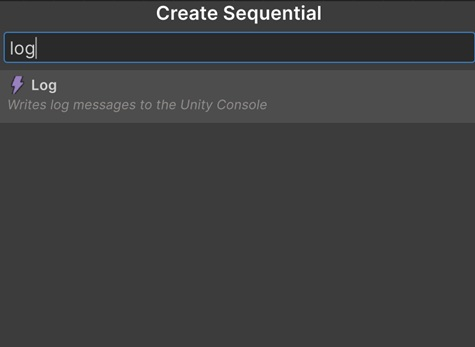

# Sequentior Graph Editor

Sequentior Graph Editor is the main window that is used to create sequential flows. 
Here you can add as many sequential nodes as you want to create your final flow of sequentials.

!!! note
    Every Sequentior Graph Editor needs to have one and only one Start Node and it's added automatically when you open the Sequentior Graph Editor for the first time even though it's deleted manually.

## Add New Sequential Node

To add a new sequential node to the graph, just __right click__ with your mouse and a popup will appear.

Here select the __Create Node__ menu item and a new window appears.

In this window, you can browse all the sequential nodes that can be added to the graph and they are all categorized.
Also, you can search for a sequential node by typing to the textbox on top of this window.

Now click __Debug__ and all the sequentials in Debug category will appear.
There is only __Log__ sequential in Debug category. 
Select it.

That's it! You've added a new sequential node to the graph.

!!! note
    If you look at the gameobject now, you see that it has 2 child gameobjects with related sequential component added. Also you can see that the Sequential list of the Sequentior Manager component is filled with those gameobjects too.

## Connect Sequentials

You've added the Log sequential node but currently that won't do anything because it's not connected yet to any other sequential node.

The entry point of the Sequentior Graph Editor is Start Sequential and you need to connect the first sequential node to the Start Sequential.

But how to connect sequential nodes?

Every sequential nodes have two common pins. One is __NEXT__ pin and the other is __IN__ pin.

!!! note
    Start Sequential node does not have an IN pin because it's the entry node and no other node can connect to it's IN pin.

So, __NEXT__ pin will be connected to the next sequence (sequential node) __IN__ pin so the Sequentior Manager knows which sequential node to be started next.

Now, click and hold the left mouse button on the __NEXT__ pin of the Start Sequential and drag it to the __IN__ pin of the Log sequential.

That's it! Now it's connected and Seqentior Manager knows which sequential to start next after the Start Sequential.

!!! quote "Summary"
    So, whenever you add a new sequential node, connect another node's __NEXT__ pin to this newly added sequential's __IN__ pin and it's ready to play.

## Disconnect

The best part of the Graph Editor is that you can reshape the whole flow by disconnecting existing ones and reconnect them to another nodes.

To disconnect, __righ click__ the connection wire (edge) and choose __Delete__.

## Navigating Graph Editor

### Zoom
You can zoom in and out the graph editor by using scroll wheel of your mouse.

### Panning
You can pan the graph by clicking and holding the middle button (scroll wheel button) of your mouse and drag mouse in any direction.

## Remove a Sequential

You can __right click__ on a sequential node and choose __Delete__ 

!!! warning
    Do not delete the auto generated sequential child gameobjects manually from Hierarchy! This will break the Sequentior Graph Editor. If you somehow deleted a child gameobject manually then you need to remove the item in the Sequential list of the Sequentior Manager component too, then the graph editor works again as expected.

## Test your first Sequentior

Now, just enter a text to the __Log__ property of the Log Sequential and then enter Play mode in your game.

If everything works as expected, you'll see the log text in Console.