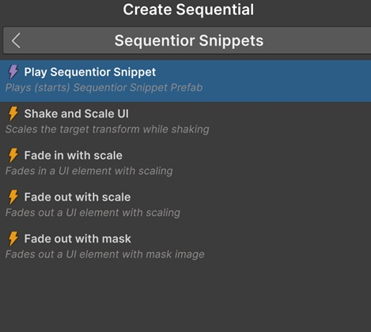
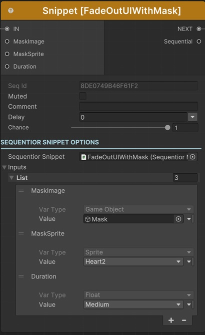

# Play Sequentior Snippet

There are two ways of playing a sequentior snippet.

## Searching or Selecting from list

If you're searching for a built-in sequentior snippet, use the Create Sequential window and search for its name or keywords.

!!! note
    To learn how to add your custom sequentior snippets to the Create Sequential search list, please refer to [this](sequentiorsnippetlist.md)

## Adding Play Sequentior Snippet Sequential

To play your custom sequentior snippets (that are not added to the Create Sequential Search List), you need to add a Play Sequentior Snippet sequential to the graph.

### Sequentior Snippet

The only thing you need to do is to assign you custom snippet prefab to the Sequentior Snippet property.

### Inputs

After assigning a custom snippet, this list will be created automatically with the __Exposed variables__ of the custom sequentior snippet prefab's SequentiorManager.

Here, you can set the values of each input.

!!! info
    To learn more about assigning values with different options, see [Value Assign](../valueassign.md)

### Input Ports

When you add a built-in sequentior snippet to the graph or when you assign a new prefab to the Sequentior Snippet property of Play Sequentior Snippet Sequential, input ports for all exposed variables (inputs) will be created automatically and you can connect another sequential's related output ports to these input ports to set their value.
 
