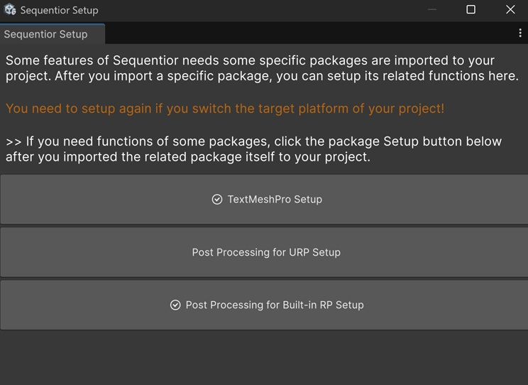

# Setup Additional Features

Some features of Sequentior needs some specific packages are imported to your project. After you import a specific package, you can setup its related functions by opening __Tools -> KerimKaynakci Games -> Sequentior Setup__ from the main menu of Unity Editor.

## TextMeshPro

Although TextMeshPro UPM package is already included in a project, TextMesh Pro TMP package needs to be installed manually. So Sequentior cannot assume it's included in your project. So you need to tell Sequentior that you've the TextMeshPro package in your project.

To make this happen, click the "TextMeshPro Setup" button in this Setup window.

!!! note
    This setup procedure will simply add __"SEQUENTIOR_TMP"__ to the _Scripting Define Symols_ of your project. And in the sequential scripts, TextMeshPro related codes defined in the scope of this define symbol.

!!! warning
    You need to setup again if you switch the target platform of your project!
