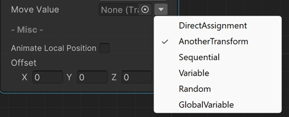
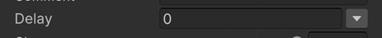
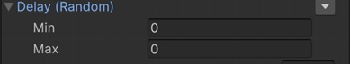
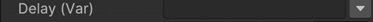
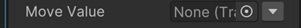
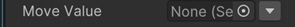
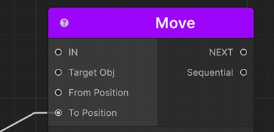
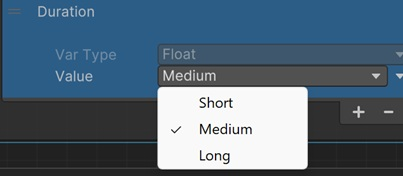

# Assigning Values

Most of the time we assign values to the sequentials by entering the value directly. For example to delay a sequential play action, we set a constant float value like 0.5. 

But, for advanced scenarios we need more because some values might depend on another value in our game, or it depends on another transform's some value. To handle these situtations, there are multiple options for assigning values to most of the fields in sequentials. And this depends on the field property. For example if the value is a float value, you can assign it directly or from a variable, but if it's a Vector3 value, you can assign it directly or from the position of another transform.

Now, let's see each value assign options.

!!! note
    Whenever you see a down arrow  icon next to a property, that means this field has some another value assign options to choose from. But please note that not all the options are available for all fields of sequentials.

## Direct Assignment
In this option, you directly enter a value. 

For example, you can enter a floating point number for a float type field or you can enter X,Y and Z values for a Vector3 type field. 

## Random
In this option, you can specify a range of values and a random value will be choosen in this range.

For example, you can enter Min and Max values of the range for a float type field and when the sequential performs its related action, it will evaluate the random function within this range and selects a random number.

## Variable
In this option, you can enter a variable name instead of the value itself and sequential will get the exact value from the variables list of the parent Sequentior Manager.

This is useful for assigning values that can be defined or modified at runtime.

!!! info
    See [Variables](variables/variables.md) for more information about variables.

## Global Variable

In this option, you can select a global variable scriptable object and sequential will get the exact value from this scriptable object.

This is useful for assigning global (project scope) values. For example, you can create a global variable for duration of a popup open animation and use this global variable for every sequential that needs that duration value. Then when you modify the value of this global variable, all the sequentials will get the same new value without changing anything in those sequentials.

!!! info
    See [Global Variables](variables/globalvariables.md) for more information about Global Variables.

## Another Transform

In this option, you can select another transform and sequential will try to get the related property of the transform in the context of this specific field. This will let you assign dynamic values to properties of sequentials.

For example, you can assign to another transform to the MoveValue of a Move sequential, so it will get the position of this transform as the MoveValue.

## Transform Array

Same as the __Another Transform__ but this is the array version.

## Sequential

In this option, you can connect another sequential's Sequential output port to the appropriate input port of this sequential and it will get the value from this connected sequential's returned game object.

## Predefined Values

In this option, you can select from a list of predefined values.

