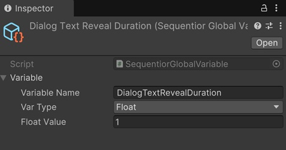

# Global Variables

Unlike local variables which are only accessible from the sequentials of the Sequentior Manager defined on, global variables are accessible by each sequential in the whole project because these are Scriptable Objects.

By using global variables, you define a variable and its value once and use the same value in many different sequentials. This way, if you change the variable value, all the sequentials will have the same modified value. So it makes your sequentials more managable.

For example, you can define a global variable for duration of a popup show animation and use this value for every animation sequential that opens a popup. Or you can define a global color variable and use this color variable in every Color Change Sequential that changes a UI Image component.

## How to define global variable?

To create a new global variable, right click on the Project view then __Create -> Sequentior -> Global Variable__.

!!! tip
    To learn more about how to use global variables in sequentials, please refer to [Value Assign](../valueassign.md) section.

## Variable Name
This name that defines the variable.

## Var Type
This is the data type of the variable.

## Is Array
If you want to define the variable as an array, enable this option.

## Variable Values
This is the default/initial value of the variable.

This field is dynamic and changes in accordance with __Var Type__ and __Is Array__ properties.
